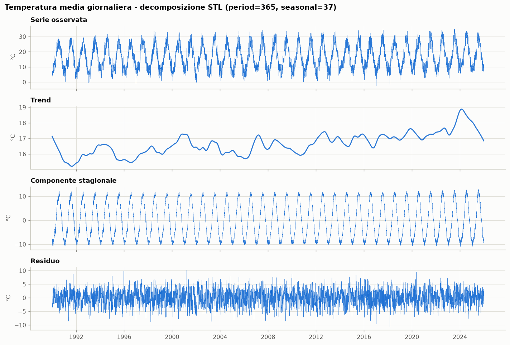
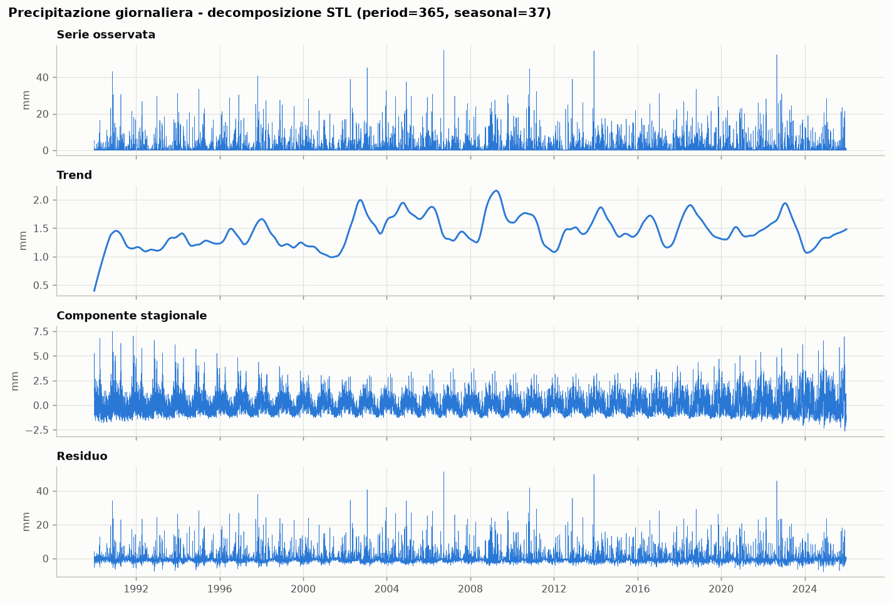
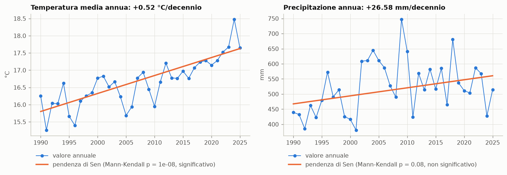
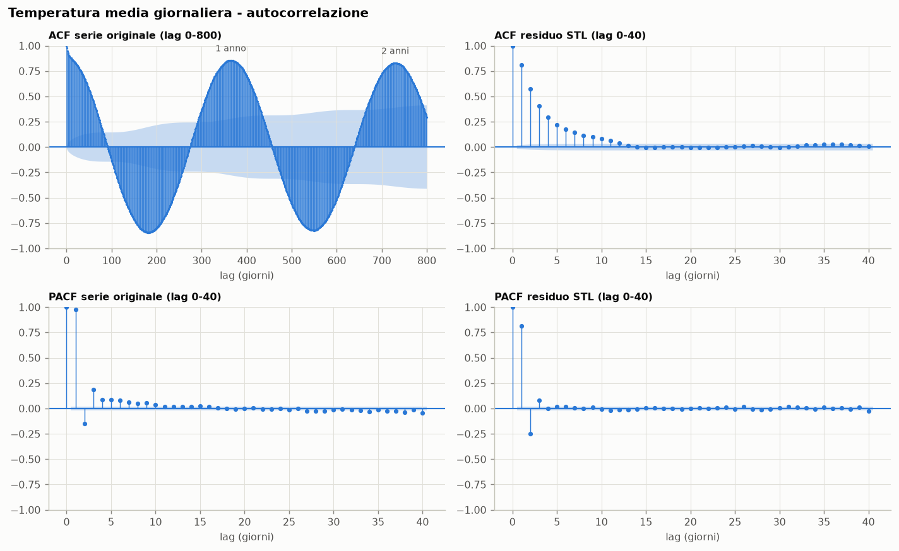
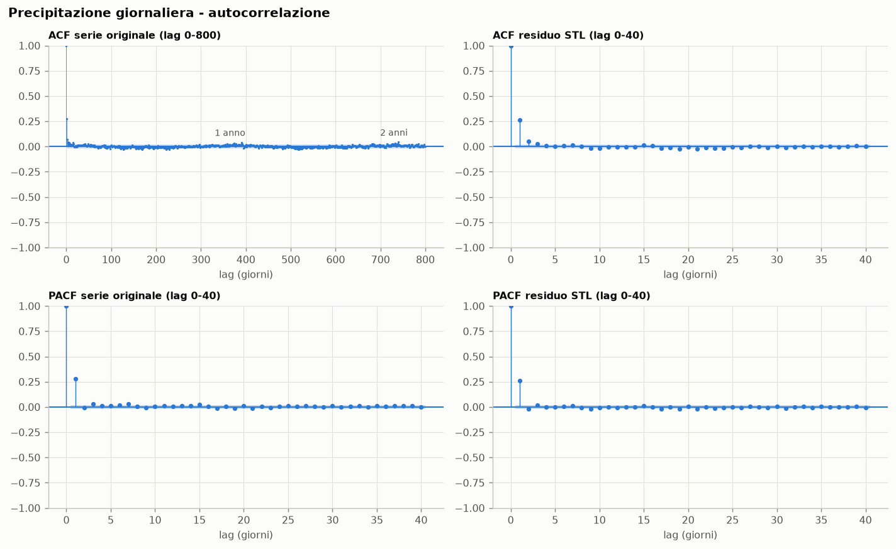
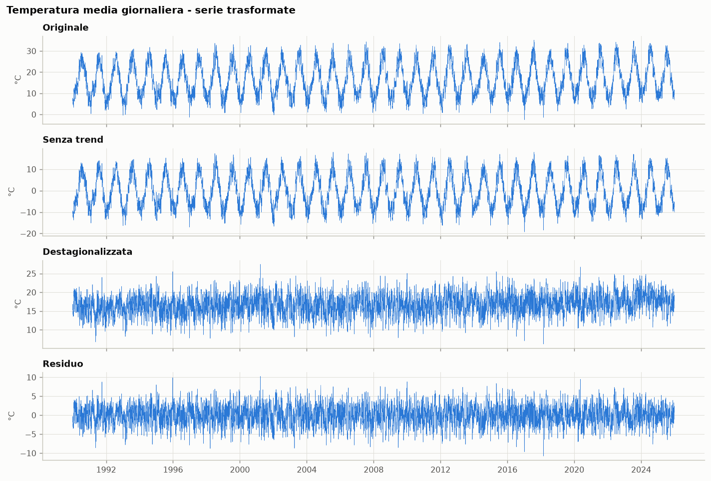
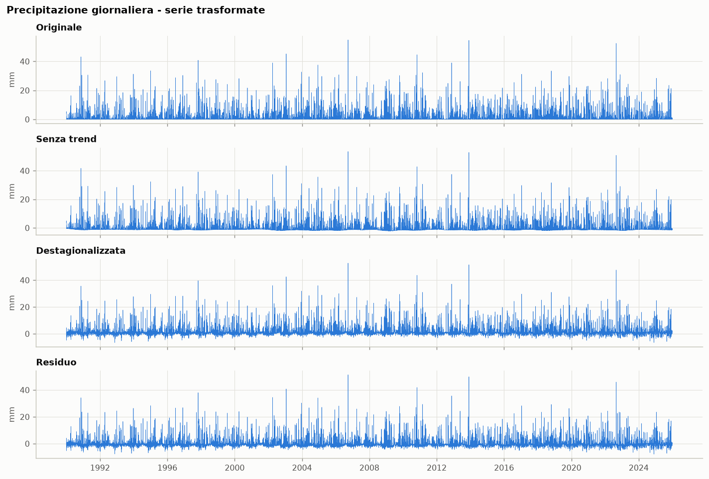
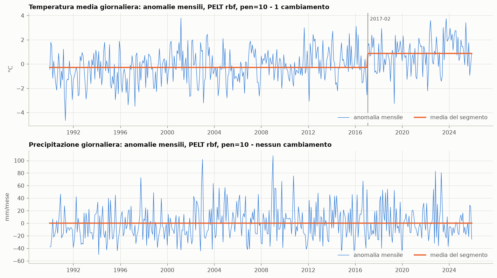

# Analisi della serie temporale - task 2-7

Analisi statistica delle due variabili da prevedere, sulla cella ERA5-Land di Foggia
(41,5 °N / 15,5 °E), dati giornalieri **1990-01-01 → 2025-12-30**, 13.148 giorni, nessun
valore mancante:

- `t2m_mean`: temperatura media giornaliera a 2 m (°C)
- `tp_mm`: precipitazione totale giornaliera (mm)

La task 1 (analisi esplorativa) è in `src/eda.py`, con le tabelle in `data/eda/`.

```bash
python -m src.task_analisistazionarieta                    # tutte le task, circa 3 minuti
python -m src.task_analisistazionarieta.t3_mann_kendall    # una task sola
```

Tutti i risultati finiscono in `results/`: tabelle in Parquet, grafici in `results/figures/`.

## In sintesi

1. **La temperatura è dominata dalla stagionalità**: il ciclo annuale spiega l'88% della
   varianza giornaliera. Sotto c'è un **trend crescente di +0,52 °C per decennio**,
   significativo in tutte le varianti del test di Mann-Kendall.
2. **La precipitazione giornaliera non ha né stagionalità forte né trend robusto**: la
   stagionalità spiega il 7% della varianza, e il trend sparisce appena il test tiene conto
   dell'autocorrelazione.
3. **ADF e KPSS dichiarano "stazionarie" entrambe le serie originali, e non è una
   contraddizione**: i due test cercano la non stazionarietà stocastica (radice unitaria),
   non la stagionalità o un trend deterministici. Lo mostra un controllo su serie sintetiche,
   e lo conferma la task 6: tolta la stagionalità, il KPSS vede il trend della temperatura.
4. **La memoria è breve**: l'anomalia di temperatura resta correlata per circa 12 giorni,
   con una struttura di tipo AR(2); la pioggia per un giorno solo.
5. **Nessuna discontinuità strutturale**: l'unico punto di cambiamento trovato (febbraio
   2017) è il riscaldamento stesso visto come un gradino, e sparisce togliendo il trend.

---

## Task 2 - Decomposizione STL

`STL(series, period=365, seasonal=37, robust=False)`, sulla serie giornaliera.

### Perché non i parametri di default

Il parametro `seasonal` è la finestra con cui STL media ogni giorno del calendario
attraverso gli anni. Con il default `seasonal=7` ogni valore stagionale nasce da circa 7
anni, e la componente stagionale si porta dietro rumore. Il confronto
(`stl_sensitivity.parquet`):

| Variabile | `seasonal` | `robust` | Quota di varianza stagionale | Rumore nella componente stagionale |
|---|---|---|---|---|
| Temperatura | 7 | no | 0,901 | 1,15 °C |
| Temperatura | **37** | no | **0,879** | **0,56 °C** |
| Pioggia | 7 | no | 0,266 | 1,76 mm |
| Pioggia | 7 | sì | 0,214 | 1,63 mm |
| Pioggia | **37** | no | **0,074** | **0,84 mm** |
| Pioggia | 37 | sì | 0,001 | 0,09 mm |

Con il default, alla pioggia viene attribuita una stagionalità del 27% della varianza,
quando la climatologia calcolata nell'EDA ne spiega il 4%: la componente stagionale sta
assorbendo i singoli nubifragi. Con `seasonal=37` la finestra copre tutti i 36 anni: la
forma stagionale è stabile, ma può ancora evolvere lentamente.

`robust=True` sarebbe la scelta naturale per una variabile con valori estremi, ma qui
sbaglia nella direzione opposta: il giorno mediano è asciutto, quindi la procedura robusta
tratta *ogni* giorno di pioggia come un outlier e azzera la stagionalità (0,1%).

### Risultati (`stl_summary.parquet`)

Forza delle componenti secondo Wang, Smith e Hyndman (2006): 0 = componente assente,
1 = componente dominante.

| | Temperatura (giornaliera) | Pioggia (giornaliera) | Pioggia (totali mensili) |
|---|---|---|---|
| Forza stagionale | **0,889** | 0,086 | 0,280 |
| Forza del trend | 0,081 | 0,008 | 0,133 |
| Quota di varianza: stagionale | 87,9% | 7,4% | 24,6% |
| Quota di varianza: residuo | 11,0% | 90,7% | 64,8% |
| Pendenza del trend | **+0,52 °C/decennio** | +0,08 mm/giorno per decennio | +2,4 mm/mese per decennio |
| Ampiezza del ciclo annuale | 20,3 °C | 1,9 mm/giorno | 48 mm/mese |





### Discussione

**Importanza della componente stagionale.** Per la temperatura è la componente
principale: il ciclo annuale spiega l'88% della varianza giornaliera, con un'ampiezza di
20,3 °C tra fine dicembre e fine luglio. Per la pioggia è debole a scala giornaliera (7%):
il regime mediterraneo esiste (autunno-inverno piovosi, estate secca) ma è sommerso dalla
variabilità da un giorno all'altro. Emerge meglio a scala mensile, dove la forza stagionale
sale a 0,28.

**Trend di lungo termine.** La temperatura ha un trend chiaro: la componente di trend sale
di circa +1,2 °C tra il 1990 e il 2025, cioè +0,52 °C per decennio, in linea con l'EDA.
La sua "forza" è bassa (0,08) non perché sia trascurabile, ma perché è piccola rispetto alla
variabilità giornaliera: 1,2 °C in 36 anni, contro una deviazione standard dell'anomalia
giornaliera di 2,7 °C. Per la pioggia il trend è praticamente nullo (forza 0,008).

Un segnale secondario da non sovrainterpretare: l'ampiezza stagionale della temperatura
passa da 19,9 °C (1990-94) a 20,9 °C (2021-25), come se le estati si scaldassero più degli
inverni.

**Limiti.** Le componenti STL sono meno affidabili ai bordi della serie: le curve del trend
nel 1990 e nel 2025 piegano per costruzione, non per un fenomeno reale. Con dati orari la
decomposizione richiederebbe due stagionalità, giornaliera (24 ore) e annuale (8.766 ore),
cioè MSTL invece di STL.

---

## Task 3 - Test di Mann-Kendall

Il test è applicato in quattro varianti, perché quella dell'esempio (`original_test`
sulla serie giornaliera) ne viola le ipotesi: richiede osservazioni indipendenti, mentre la
serie è stagionale e fortemente autocorrelata.

| Variabile | Serie | Test | n | Esito | p | z | Pendenza per decennio |
|---|---|---|---|---|---|---|---|
| Temperatura | giornaliera | `original_test` | 13.148 | crescente | < 10⁻¹⁵ | 8,44 | +0,56 °C |
| Temperatura | giornaliera destagionalizzata | `original_test` | 13.148 | crescente | < 10⁻¹⁵ | 23,0 | +0,52 °C |
| Temperatura | giornaliera destagionalizzata | `hamed_rao_modification_test` | 13.148 | crescente | < 10⁻¹⁵ | 9,85 | +0,52 °C |
| Temperatura | mensile | `seasonal_test` | 432 | crescente | 4,7 × 10⁻¹⁵ | 7,84 | +0,53 °C |
| Temperatura | annuale | `original_test` | 36 | **crescente** | **1,3 × 10⁻⁸** | 5,68 | **+0,52 °C** |
| Pioggia | giornaliera | `original_test` | 13.148 | crescente | 0,021 | 2,31 | ≈ 0 mm/giorno |
| Pioggia | giornaliera destagionalizzata | `original_test` | 13.148 | crescente | 0,003 | 3,01 | +0,03 mm/giorno |
| Pioggia | giornaliera destagionalizzata | `hamed_rao_modification_test` | 13.148 | **assente** | **0,39** | 0,86 | +0,03 mm/giorno |
| Pioggia | mensile | `seasonal_test` | 432 | crescente | 0,035 | 2,10 | +2,1 mm/mese |
| Pioggia | annuale | `original_test` | 36 | **assente** | **0,079** | 1,76 | +26,6 mm/anno |



Le varianti corrette sono tre: la versione di **Hamed e Rao** (1998), che corregge la
varianza della statistica S per l'autocorrelazione; il **test stagionale**, che confronta
ogni mese solo con lo stesso mese degli altri anni, così che la stagionalità non conta; il
test sulle **medie annuali**, dove le osservazioni sono quasi indipendenti.

### Interpretazione

- **Temperatura: trend crescente significativo.** Tutte le varianti concordano, con una
  pendenza di Sen tra +0,52 e +0,56 °C per decennio. La correzione per l'autocorrelazione
  riduce z da 23,0 a 9,85, ma il risultato resta fortissimo.
- **Pioggia: assenza di trend significativo.** Il test classico sulla serie destagionalizzata
  dà p = 0,003, ma con la correzione di Hamed-Rao il trend sparisce (p = 0,39): la
  "significatività" era un effetto della persistenza da un giorno all'altro, che gonfia il
  numero effettivo di osservazioni indipendenti. Sui totali annuali p = 0,079; solo il test
  stagionale mensile resta appena sotto la soglia (p = 0,035). Un segnale che dipende dalla
  variante del test non è robusto: **non c'è evidenza di un trend nella pioggia**.

Il confronto tra le due righe destagionalizzate è il punto metodologico della task: stesso
dato, stessa pendenza, ma lo z passa da 23,0 a 9,85 (temperatura) e da 3,01 a 0,86
(pioggia). Su serie autocorrelate il test classico è troppo ottimista.

---

## Task 4 - Test di stazionarietà

ADF con `autolag="AIC"`; KPSS con `nlags="auto"`, sia attorno a una costante (`c`) sia
attorno a un trend lineare (`ct`).

| Test | Ipotesi nulla | Stazionaria se |
|---|---|---|
| ADF | radice unitaria (non stazionaria) | p < 0,05 |
| KPSS | stazionaria | p > 0,05 |

### Risultati sulla serie originale (`stationarity_raw.parquet`)

| Variabile | ADF stat | ADF p | KPSS(c) p | KPSS(ct) p | Verdetto |
|---|---|---|---|---|---|
| Temperatura | −9,00 | 6,4 × 10⁻¹⁵ | > 0,10 | > 0,10 | stazionaria |
| Pioggia | −26,0 | < 10⁻¹⁵ | 0,070 | 0,062 | stazionaria |

statsmodels interpola il p-value del KPSS da una tabella che copre solo l'intervallo
[0,01; 0,10]: "> 0,10" significa che il p vero è oltre il bordo della tabella.

### Perché "stazionaria" anche con un ciclo annuale e un trend

Il verdetto è formalmente corretto, ma va letto bene: **ADF e KPSS cercano la non
stazionarietà stocastica**, cioè una radice unitaria o una passeggiata aleatoria. Un ciclo
annuale o un trend lineare sono componenti **deterministiche**, che questi test non vedono.
Lo mostrano due controlli.

**Controllo su serie sintetiche** (`stationarity_synthetic.parquet`), lunghe come la nostra:

| Serie sintetica | ADF p | KPSS(c) p | Verdetto |
|---|---|---|---|
| rumore bianco | < 10⁻¹⁵ | > 0,10 | stazionaria |
| stagionalità + rumore | 1,9 × 10⁻²⁵ | > 0,10 | stazionaria |
| stagionalità + rumore + trend (+1,4 in 36 anni, come il nostro) | 2,1 × 10⁻²⁵ | > 0,10 | stazionaria |
| stagionalità + rumore + passeggiata aleatoria | 6,2 × 10⁻¹¹ | < 0,01 | contrastante |

Una sinusoide perfetta passa entrambi i test; il trend della dimensione del nostro anche.
Solo la passeggiata aleatoria viene rilevata, e solo dal KPSS: l'ADF ha poca potenza quando
la componente stocastica è piccola rispetto al rumore.

**Sensibilità del KPSS ai lag** (`stationarity_kpss_lags.parquet`). Il KPSS stima una
varianza di lungo periodo con un numero di lag da scegliere, e sulla temperatura il
verdetto cambia:

| Lag | 5 | 10 | 20 | 40 | 69 (auto) | 150 | 365 |
|---|---|---|---|---|---|---|---|
| KPSS(c) p, temperatura | < 0,01 | < 0,01 | 0,071 | > 0,10 | > 0,10 | > 0,10 | < 0,01 |

Con pochi lag il test rifiuta la stazionarietà, con la scelta automatica no. Il ciclo
annuale gonfia la stima della varianza di lungo periodo, e questo nasconde il trend.

**Conclusione.** Nessuna delle due serie ha una radice unitaria: **non serve
differenziarle**. La stagionalità e il trend vanno trattati come componenti deterministiche
da stimare e rimuovere (task 6), non da eliminare con le differenze.

---

## Task 5 - ACF e PACF

ACF fino a 800 lag sulla serie originale, per vedere i picchi annuali; ACF e PACF fino a 40
lag sia sulla serie originale sia sul residuo STL. Con 13.148 osservazioni la banda di
confidenza al 95% è stretta, circa ±0,017: correlazioni minuscole risultano
"statisticamente significative" pur essendo irrilevanti in pratica.

| | ACF lag 1 | ACF lag 7 | ACF lag 30 | ACF lag 365 | ACF non più significativa dal lag | PACF lag 1 | PACF lag 2 |
|---|---|---|---|---|---|---|---|
| Temperatura, originale | 0,977 | 0,891 | 0,761 | **0,855** | 82 | 0,977 | −0,148 |
| Temperatura, residuo STL | **0,811** | 0,142 | −0,006 | −0,076 | **13** | 0,811 | **−0,250** |
| Pioggia, originale | 0,277 | 0,041 | 0,014 | 0,016 | 9 | 0,277 | −0,010 |
| Pioggia, residuo STL | **0,260** | 0,017 | 0,001 | −0,070 | **4** | 0,260 | −0,019 |





### Discussione

**Persistenza.** L'ACF della temperatura originale decade lentissimamente: 0,98 a un giorno,
ancora 0,76 a un mese. Non è memoria meteorologica, è la stagionalità: a luglio fa caldo
come la settimana prima perché è luglio. Sul residuo la persistenza vera è molto più breve:
0,81 a un giorno, 0,14 a una settimana, non significativa dal 13° giorno. La pioggia ha
persistenza di un solo giorno (0,26-0,28), poi nulla.

**Periodicità stagionale.** L'ACF della temperatura originale è un'onda di periodo un anno:
massimi a 365 giorni (0,855) e 730 giorni (0,829), minimo a 181 giorni (−0,844), cioè
estate contro inverno. Sul residuo STL la periodicità sparisce, segno che la decomposizione
l'ha rimossa. Nella pioggia giornaliera nessuna periodicità è visibile: coerente con la
stagionalità debole della task 2.

**Strutture autoregressive.** La PACF del residuo di temperatura ha due picchi netti,
0,81 al lag 1 e −0,25 al lag 2, poi valori trascurabili (0,08 al lag 3): è la firma di un
processo **AR(2)**, con un piccolo contributo al lag 3. Il segno negativo al lag 2 indica
che, a parità di ieri, un'anomalia calda di due giorni fa tende a rientrare. La pioggia
mostra un solo picco (0,26 al lag 1), la firma di un **AR(1) debole**.

Una nota sul residuo: l'ACF a 365 giorni è leggermente negativa (−0,076). È un artefatto
della STL, che stimando la stagionalità di ogni anno assorbe parte delle anomalie degli anni
vicini.

---

## Task 6 - Rimozione di trend e stagionalità

Dalle componenti STL: senza trend = serie − trend; destagionalizzata = serie − stagionalità;
residuo = `result.resid`. Stessi test della task 4 (`stationarity_transformed.parquet`).

| Variabile | Serie | ADF p | KPSS(c) stat | KPSS(c) p | KPSS(ct) p | Verdetto |
|---|---|---|---|---|---|---|
| Temperatura | originale | 6,4 × 10⁻¹⁵ | 0,14 | > 0,10 | > 0,10 | stazionaria |
| Temperatura | senza trend | 4,6 × 10⁻¹⁵ | 0,005 | > 0,10 | > 0,10 | stazionaria |
| Temperatura | **destagionalizzata** | 2,8 × 10⁻²⁴ | **5,07** | **< 0,01** | 0,059 | contrastante |
| Temperatura | residuo | < 10⁻¹⁵ | 0,004 | > 0,10 | > 0,10 | stazionaria |
| Pioggia | originale | < 10⁻¹⁵ | 0,42 | 0,070 | 0,062 | stazionaria |
| Pioggia | senza trend | < 10⁻¹⁵ | 0,004 | > 0,10 | > 0,10 | stazionaria |
| Pioggia | **destagionalizzata** | < 10⁻¹⁵ | 0,57 | **0,026** | **0,021** | contrastante |
| Pioggia | residuo | < 10⁻¹⁵ | 0,003 | > 0,10 | > 0,10 | stazionaria |





### Discussione

**I residui sono stazionari** per entrambe le variabili, con tutti i test concordi: la STL
ha separato le componenti non stazionarie.

**La riga più istruttiva è la temperatura destagionalizzata.** Tolto il ciclo annuale, il
KPSS(c) passa da 0,14 a 5,07 e rifiuta nettamente la stazionarietà attorno a una costante:
ora vede il trend, che il ciclo annuale nascondeva. Il KPSS(ct), che ammette un trend
lineare, non rifiuta (p = 0,059): la temperatura è **stazionaria attorno a un trend
lineare**. È la conferma, per un'altra strada, del risultato di Mann-Kendall.

**La pioggia destagionalizzata** rifiuta il KPSS anche ammettendo un trend lineare
(p = 0,021). Non c'è radice unitaria (ADF p < 10⁻¹⁵): il segnale viene dalla variabilità a
bassa frequenza, cioè da periodi pluriennali più umidi o più secchi (2002-2006, 2009-2010),
visibili anche nella componente di trend della STL, che non è lineare.

### Attenzione: le componenti STL non sono utilizzabili per prevedere

La STL è una decomposizione **centrata**: il trend e la stagionalità di un giorno sono
stimati usando anche i giorni successivi. È corretto per descrivere la serie, ma usare le
componenti STL come input di un modello di previsione è **leakage**, perché il modello
vedrebbe informazione dal futuro. Per i modelli la climatologia va calcolata sul solo
training set, con feature che usano solo il passato.

---

## Task 7 - Cambiamenti strutturali (opzionale)

`ruptures.Pelt(model="rbf")` come nell'esempio, con due scelte motivate:

- **Anomalie mensili, non la serie giornaliera.** Sulla serie grezza il metodo troverebbe un
  "cambiamento" a ogni cambio di stagione. Le anomalie (valore mensile meno la media di quel
  mese) tolgono il ciclo annuale. Il costo `rbf` costruisce inoltre una matrice n × n:
  13.148² valori sarebbero circa 1,4 GB, contro i 432 dei mesi.
- **Anche senza trend lineare.** Un trend costante appare a un metodo di questo tipo come
  una scala di gradini: ripetere l'analisi sulle anomalie senza trend separa i salti veri
  dal riscaldamento graduale.

Risultati per penalità (`change_points.parquet`):

| Variabile | Serie | pen = 1 | pen = 2 | pen = 3 | pen = 5 | **pen = 10** | pen = 20 |
|---|---|---|---|---|---|---|---|
| Temperatura | anomalie mensili | 19 punti | 5 punti | 2006-09, 2019-03 | 2017-02 | **2017-02** | nessuno |
| Temperatura | anomalie senza trend | 23 punti | 6 punti | nessuno | nessuno | **nessuno** | nessuno |
| Pioggia | anomalie mensili | 15 punti | 2002-02, 2019-08 | nessuno | nessuno | **nessuno** | nessuno |
| Pioggia | anomalie senza trend | 15 punti | nessuno | nessuno | nessuno | **nessuno** | nessuno |



### Discussione

Con la penalità dell'esempio (10) l'unico cambiamento è nella temperatura, a **febbraio
2017**: l'anomalia media passa da −0,29 °C a +0,87 °C. Togliendo il trend lineare sparisce,
e non compare nessun altro punto per penalità ≥ 3. Quel punto è quindi **il riscaldamento
visto come un gradino**, non una discontinuità: il metodo, che può descrivere solo medie
costanti a tratti, approssima una rampa con un salto. Per la pioggia non c'è nessun
cambiamento stabile.

Le cause elencate dalla traccia, una per una:

- **Sostituzione del sensore, spostamento della stazione**: non applicabili. ERA5-Land è
  una rianalisi, non una stazione: non ha sensori né posizione che possano cambiare.
  Discontinuità artificiali potrebbero venire dai cambiamenti delle osservazioni assimilate
  in ERA5 nel corso degli anni, ma non se ne vedono.
- **Eventi meteorologici estremi**: durano giorni o settimane, troppo poco per apparire
  come cambiamento strutturale su anomalie mensili.
- **Cambiamenti climatici**: sono l'unico segnale presente, ma come trend graduale
  (task 3 e 6), non come salto.

Il risultato dipende molto dalla penalità: con pen = 1 si trovano 19-23 "cambiamenti", che
sono semplicemente rumore. Il risultato robusto è l'assenza di discontinuità indipendenti dal
trend: **la serie è omogenea**, il che è anche un controllo di qualità sul dataset.

---

## Cosa cambia per i modelli di previsione

- **Nessuna differenziazione**: le serie non hanno radice unitaria. Conviene modellare le
  anomalie rispetto a stagionalità e trend.
- **Il trend va gestito.** La temperatura media del train (1990-2017) è 16,39 °C, quella
  del test (2022-2025) 17,83 °C: una climatologia calcolata sul solo train partirà con un
  errore sistematico di circa **1,4 °C** sul test, e di 0,8 °C già sulla validation
  (2018-2021). È più di quanto dica il solo trend lineare, perché gli anni di test sono tra
  i più caldi della serie.
- **Finestre di input brevi**: la memoria dell'anomalia di temperatura si esaurisce in circa
  12 giorni, con struttura AR(2); per la pioggia conta solo il giorno precedente.
- **Niente componenti STL come feature**, per il leakage descritto nella task 6.

## File prodotti

| File | Task | Contenuto |
|---|---|---|
| `stl_components.parquet` | 2 | Serie osservata, trend, stagionalità e residuo giornalieri, per entrambe le variabili |
| `stl_summary.parquet` | 2 | Forza delle componenti, quote di varianza, trend, ampiezza stagionale |
| `stl_sensitivity.parquet` | 2 | Effetto dei parametri `seasonal` e `robust` |
| `mann_kendall.parquet` | 3 | Le 10 varianti del test di Mann-Kendall |
| `stationarity_raw.parquet` | 4 | ADF e KPSS sulle serie originali |
| `stationarity_kpss_lags.parquet` | 4 | KPSS al variare del numero di lag |
| `stationarity_synthetic.parquet` | 4 | ADF e KPSS su serie sintetiche di controllo |
| `acf_pacf.parquet` | 5 | Valori di ACF e PACF con bande di confidenza |
| `acf_pacf_summary.parquet` | 5 | Persistenza e lag significativi |
| `stationarity_transformed.parquet` | 6 | ADF e KPSS sulle serie trasformate |
| `change_points.parquet` | 7 | Punti di cambiamento per ogni penalità |

Librerie: statsmodels, pymannkendall, ruptures (versioni in `requirements.txt`).
